      

      

<h1>intro 👋</h1>

🔭 <b>I’m currently working on:</b> too many sideprojects @ github 
🌱 <b>I’m currently learning:</b> fsharp 
🧪 <b>I’m experimenting with:</b> Svelte + TypeScript 
🥳 <b>I’m hyped about:</b> ML | AI | WASM | WEBGPU  
💬 <b>Ask me about:</b> remote & nomadic work 
 
📫 <b>How to reach me:</b> <a href="https://johnnys.page">johnnys.page</a> 
📰 <b>Here is my blog:</b> <a href="https://johnnys.news">johnnys.news</a> 
🨠<b>This is my portfolio:</b> <a href="https://johnnys.page/portfolio">johnnys.page/portfolio</a> 
🱠<b>Here is my bento: </b> <a href="https://bento.me/johnny">bento.me/johnny</a> 
📃 <b>Here is my cv: </b> <a href="https://j0hnny.read.cv/">j0hnny.read.cv/</a> 

👤 <b>Pronouns:</b> he / him 
⚡️ <b>Fun fact:</b> 95% of my sideprojects are stuck at the last 5% 

<h1>stats 📊🧪📈</h1>
 

 

MTFBWYA ✨

      

